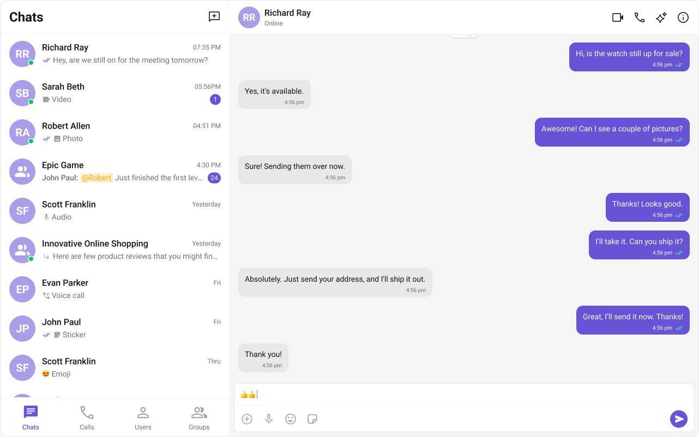

<p align="center">
  
</p>

# CometChat UI Kit for Angular

The CometChat Angular UI Kit provides a pre-built user interface kit that developers can use to quickly integrate a reliable & fully-featured chat experience into an existing or a new Angular app.

<div style="display: flex; align-items: center; justify-content: center;">
   
</div>

> **Note:** This package is currently in beta (`5.0.0-beta.2`). APIs may change before the stable release.

## Prerequisites

- Node.js >= 18
- npm >= 10
- Angular >= 17 (up to Angular 21)
- Sign up for a [CometChat](https://app.cometchat.com/) account to get your app credentials: _`App ID`_, _`Region`_, and _`Auth Key`_

## Repository Structure

This is a monorepo containing the UI Kit library, a sample application, a Storybook playground, and a documentation site.

```
├── projects/
│   ├── cometchat-uikit/     # UI Kit library (@cometchat/chat-uikit-angular)
│   └── sample-app/          # Sample Angular app demonstrating the UI Kit
├── .storybook/              # Storybook configuration & stories
└── docs/                    # Documentation site (Mintlify)
```

## Getting Started

1. Clone the repository:
   ```sh
   git clone https://github.com/cometchat/cometchat-uikit-angular.git
   ```

2. Checkout the v5 branch:
   ```sh
   git checkout v5
   ```

3. Install dependencies:
   ```sh
   npm install
   ```

4. Enter your CometChat _`App ID`_, _`Region`_, and _`Auth Key`_ in `projects/sample-app/src/main.ts`.

5. Run the sample app:
   ```sh
   npm start
   ```

## UI Kit Library

The core library lives in `projects/cometchat-uikit/` and is published as [`@cometchat/chat-uikit-angular`](https://www.npmjs.com/package/@cometchat/chat-uikit-angular).

**Build the library:**

```sh
npm run build:lib
```

Refer to the [Integration Steps](https://www.cometchat.com/docs/ui-kit/angular/v5/integration) to integrate the UI Kit into your own Angular app.

## Sample App

The sample app in `projects/sample-app/` showcases the full capabilities of the UI Kit — real-time messaging, voice & video calling, conversations, users, groups, and more.

**Run the sample app:**

```sh
npm start
```

## Storybook

Storybook provides an interactive playground to explore and test individual UI Kit components in isolation.

**Run Storybook locally:**

```sh
npm run storybook
```

**Build a static Storybook site:**

```sh
npm run build-storybook
```

## Documentation

The `docs/` directory contains the full documentation site built with [Mintlify](https://mintlify.com), covering component APIs, customization guides, theming, localization, and more.

**Run the docs site locally:**

```sh
cd docs
npm install
npm run dev
```

## Help and Support

For issues running the project or integrating with our UI Kits, consult our [documentation](https://www.cometchat.com/docs/ui-kit/angular/v5/integration) or create a [support ticket](https://help.cometchat.com/hc/en-us) or seek real-time support via the [CometChat Dashboard](https://app.cometchat.com/).
